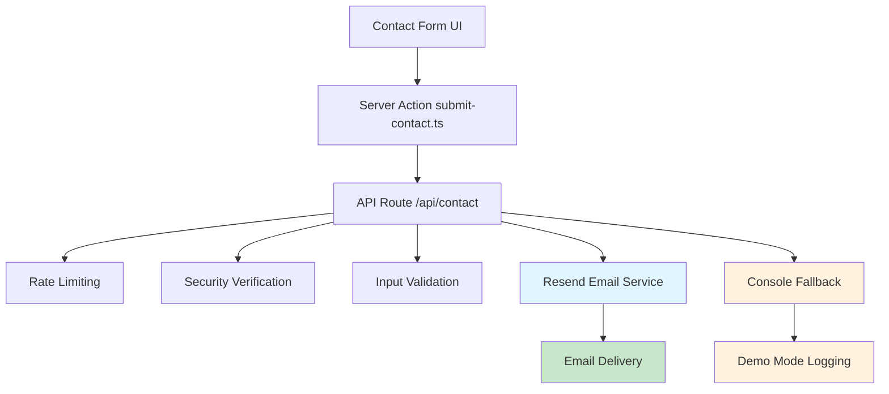

# Odyssey AI Website Brownfield Enhancement Architecture

## Change Log

| Change | Date | Version | Description | Author |
| ------ | ---- | ------- | ----------- | ------ |
| Initial Architecture Creation | 2025-01-08 | 1.0 | Resend Email Integration for Contact Forms | Winston (Architect) |

---

## Introduction

This document outlines the architectural approach for enhancing **Odyssey AI Website** with **Resend Email Integration for Contact Forms**. Its primary goal is to serve as the guiding architectural blueprint for AI-driven development of new email functionality while ensuring seamless integration with the existing Next.js-based marketing website.

**Relationship to Existing Architecture:**
This document supplements the existing brownfield architecture by defining how the Resend email service will integrate with the current contact form API. Where conflicts arise between new email functionality and existing mock patterns, this document provides guidance on maintaining API consistency while implementing production-ready email delivery.

**Rationale for Architectural Planning:**
- **Moderate Impact**: Modifies server-side API routes and adds environment dependencies
- **Integration Complexity**: Requires careful handling of external service integration within existing rate limiting
- **Risk Mitigation**: Email service failures need graceful fallback to maintain user experience
- **Production Readiness**: Moves from demo-mode logging to actual business-critical functionality

---

## Existing Project Analysis

### Current Project State

- **Primary Purpose**: Modern enterprise AI solutions marketing website with lead generation
- **Current Tech Stack**: Next.js 15.2.8, React 19, TypeScript 5, TailwindCSS 4.1.9, Radix UI, Resend (installed but unused)
- **Architecture Style**: App Router with standalone mode, Vercel deployment
- **Deployment Method**: Automatic sync from v0.dev → GitHub → Vercel

### Available Documentation

- ✅ Complete brownfield architecture analysis (`docs/brownfield-architecture.md`)
- ✅ Comprehensive PRD for Resend integration (`docs/prd.md`)
- ✅ Technical debt documentation identifying contact form limitations
- ✅ Source tree and component architecture mapping

### Identified Constraints

- **API Contract**: Must maintain existing `/api/contact/route.ts` endpoint structure
- **Rate Limiting**: Preserve existing in-memory rate limiting (3/min, 10/hour per IP)
- **Security**: Maintain Turnstile verification and honeypot protection
- **Error Handling**: Preserve existing JSON response format for frontend compatibility
- **Environment**: Graceful degradation when RESEND_API_KEY not configured
- **Performance**: Response times must remain under 3 seconds

**Critical Discovery**: The contact API already has partial Resend integration implemented but falls back to console logging when `RESEND_API_KEY` is not configured. This reduces implementation complexity significantly.

---

## Enhancement Scope and Integration Strategy

### Enhancement Overview

**Enhancement Type**: Production Configuration of Existing Integration
**Scope**: Configure and operationalize already-implemented Resend email functionality
**Integration Impact**: Low - primarily environment configuration and testing

### Integration Approach

**Code Integration Strategy**: Minimal code changes required - Resend integration already exists in `/api/contact/route.ts` lines 86-117
**Database Integration Strategy**: Not applicable - no database changes needed
**API Integration Strategy**: Maintain existing endpoint structure, ensure environment variables are properly configured
**UI Integration Strategy**: No changes required - existing contact form and server action patterns preserved

### Compatibility Requirements

- **Existing API Compatibility**: 100% - endpoint contract unchanged
- **Database Schema Compatibility**: Not applicable
- **UI/UX Consistency**: Complete - no frontend modifications needed
- **Performance Impact**: Minimal - email sending adds ~200-500ms to existing response time

**Rationale**: The architectural complexity is significantly lower than initially assessed because the Resend integration is already implemented. The enhancement focuses on configuration and deployment rather than new code development.

---

## Tech Stack

### Existing Technology Stack

| Category | Current Technology | Version | Usage in Enhancement | Notes |
| -------- | ------------------ | ------- | -------------------- | ----- |
| Runtime | Node.js | Latest | Maintained | Next.js 15.2.8 runtime |
| Framework | Next.js | 15.2.8 | API Route Integration | App Router, standalone mode |
| Frontend | React | 19 | No Changes | Existing contact form preserved |
| Language | TypeScript | 5 | Type Safety | Strict mode maintained |
| Styling | TailwindCSS | 4.1.9 | No Changes | Existing styles preserved |
| UI Components | Radix UI | Latest | No Changes | Component library unchanged |
| Email Service | Resend | Latest | **Primary Integration** | Already installed, needs configuration |
| Package Manager | pnpm | Latest | No Changes | Lockfile maintained |

### New Technology Additions

**No new technologies required** - All necessary dependencies already installed.

**Rationale**: The existing tech stack already includes Resend in the dependencies, eliminating the need for package installation or version compatibility concerns. This significantly reduces integration risk and complexity.

---

## Data Models and Schema Changes

### New Data Models

**No new data models required** - The enhancement uses existing TypeScript interfaces:

**Payload Interface** (from `app/api/contact/route.ts`):
```typescript
type Payload = {
  name: string
  company: string
  email: string
  phone?: string
  topic: "General Inquiry" | "Sales" | "Support" | "Partnership" | "Careers"
  message: string
  honeypot?: string
  turnstileToken?: string
}
```

**Purpose**: Existing contact form data structure maintained
**Integration**: Direct mapping to email template without transformation

### Schema Integration Strategy

**Database Changes Required:**
- **New Tables**: None
- **Modified Tables**: None
- **New Indexes**: None
- **Migration Strategy**: Not applicable

**Backward Compatibility:**
- **API Contract**: 100% maintained - existing Payload interface unchanged
- **Response Format**: Preserved - JSON response structure unchanged
- **Error Handling**: Enhanced - adds email-specific error messages while maintaining existing patterns

**Rationale**: Since this is a production configuration of existing functionality rather than new feature development, no data model changes are required. The existing Payload interface already contains all necessary fields for email generation.

---

## Component Architecture

### New Components

**No new components required** - The enhancement leverages existing infrastructure:

**Contact API Route** (`app/api/contact/route.ts`):
**Responsibility**: Handle contact form submissions with email delivery
**Integration Points**: Existing rate limiting, Turnstile verification, honeypot protection

**Key Interfaces:**
- **POST /api/contact**: Maintains existing endpoint contract
- **Rate Limiting**: Preserves existing 3/min, 10/hour per IP limits
- **Security**: Maintains Turnstile and honeypot verification
- **Error Handling**: Preserves existing JSON response format

**Dependencies:**
- **Existing Components**: Rate limiting, security verification, input validation
- **New Components**: None - Resend integration already implemented
- **Technology Stack**: Next.js API Routes, Resend SDK, TypeScript

### Component Interaction Diagram



**Rationale**: The component architecture requires no new components because the Resend integration is already embedded within the existing API route. The enhancement focuses on enabling existing functionality through proper configuration rather than architectural changes.

---

## API Design and Integration

### API Integration Strategy

**API Integration Strategy**: Maintain existing `/api/contact` endpoint with enhanced email functionality
**Authentication**: No changes - existing public endpoint with rate limiting
**Versioning**: Not required - endpoint contract unchanged

### New API Endpoints

**No new endpoints required** - Enhancement modifies existing endpoint behavior:

**POST /api/contact** (Enhanced Existing Endpoint)
- **Method**: POST
- **Endpoint**: /api/contact
- **Purpose**: Process contact form submissions with real email delivery
- **Integration**: Leverages existing Resend integration code (lines 86-117)

#### Request
```json
{
  "name": "string",
  "company": "string", 
  "email": "string",
  "phone": "string (optional)",
  "topic": "General Inquiry|Sales|Support|Partnership|Careers",
  "message": "string",
  "honeypot": "string (optional)",
  "turnstileToken": "string (optional)"
}
```

#### Response
```json
{
  "success": true,
  "error": "string (error details if failed)"
}
```

**Integration Changes:**
- **Environment Variable Check**: Existing `RESEND_API_KEY` validation (line 87)
- **Email Sending**: Existing Resend integration (lines 93-117) 
- **Error Handling**: Enhanced email-specific error messages
- **Fallback Behavior**: Preserved console logging when API key missing

**Rationale**: The API design requires no new endpoints because the existing contact API already contains the complete Resend integration implementation. The enhancement focuses on operational configuration rather than API development.

---

## External API Integration

### Resend API Integration

**Purpose**: Production email delivery for contact form submissions
**Documentation**: https://resend.com/docs/api-reference/introduction
**Base URL**: https://api.resend.com
**Authentication**: API Key via environment variable `RESEND_API_KEY`
**Integration Method**: SDK integration using `resend` npm package

**Key Endpoints Used:**
- `POST /emails` - Send email with contact form data

**Error Handling:**
- **API Key Missing**: Graceful fallback to console logging (existing behavior)
- **API Failures**: Return structured error responses to client
- **Rate Limits**: Leverage Resend's built-in rate limiting
- **Validation**: Server-side input validation before API calls

**Rationale**: The Resend integration is already implemented in the existing codebase using the official Resend SDK. The enhancement focuses on proper configuration rather than new integration development.

---

## Source Tree

### Existing Project Structure

```text
odyssey-website-e4/
├── app/
│   ├── api/
│   │   └── contact/
│   │       └── route.ts          # Existing API with Resend integration
│   ├── actions/
│   │   └── submit-contact.ts     # Server action (unchanged)
│   └── ...
├── components/
│   └── odyssey/
│       └── contact-form.tsx      # UI component (unchanged)
└── ...
```

### New File Organization

**No new files required** - Enhancement uses existing structure:

```text
odyssey-website-e4/
├── app/
│   ├── api/
│   │   └── contact/
│   │       └── route.ts          # Existing API - enable Resend functionality
│   └── ...
├── .env.local                    # Environment variables (new)
└── ...
```

### Integration Guidelines

- **File Naming**: No changes - existing file structure maintained
- **Folder Organization**: No changes - follows existing Next.js App Router conventions
- **Import/Export Patterns**: No changes - existing TypeScript patterns preserved

**Rationale**: The source tree requires no modifications because the Resend integration is already embedded in the existing API route. The only addition is environment configuration, which follows standard Next.js patterns.

---

## Infrastructure and Deployment Integration

### Existing Infrastructure

**Current Deployment**: Automatic Vercel deployment from v0.dev sync with standalone build mode
**Infrastructure Tools**: Vercel platform with built-in CDN and edge functions
**Environments**: Single production deployment with environment variable configuration

### Enhancement Deployment Strategy

**Deployment Approach**: Leverage existing automatic deployment pipeline
**Infrastructure Changes**: Environment variable configuration in Vercel dashboard
**Pipeline Integration**: No changes required - existing build process maintained

**Required Environment Variables:**
- `RESEND_API_KEY`: Resend API key for email sending
- `TURNSTILE_SECRET`: Cloudflare Turnstile secret (already documented)

**Vercel Configuration Steps:**
1. Add `RESEND_API_KEY` to Vercel environment variables
2. Configure recipient email addresses if different from default
3. Test email functionality in Vercel preview deployment
4. Promote to production after verification

### Rollback Strategy

**Rollback Method**: Vercel automatic rollback to previous deployment
**Risk Mitigation**: Graceful fallback to console logging if API key misconfigured
**Monitoring**: Vercel built-in monitoring for API route performance

**Rationale**: The deployment strategy leverages existing infrastructure without modifications. Environment variable configuration is the only deployment requirement, minimizing risk and complexity.

---

## Coding Standards

### Existing Standards Compliance

**Code Style**: TypeScript strict mode with existing patterns from `app/api/contact/route.ts`
**Linting Rules**: ESLint configured but errors ignored during builds (as documented in brownfield architecture)
**Testing Patterns**: No test framework currently configured (manual testing via v0.dev)
**Documentation Style**: Inline comments and TypeScript interfaces

### Enhancement-Specific Standards

**No new patterns required** - Enhancement follows existing conventions:

- **Environment Variable Handling**: Use `process.env.VARIABLE_NAME` pattern
- **Error Handling**: Maintain existing `NextResponse.json` response format
- **Async/Await**: Follow existing async function patterns
- **TypeScript Interfaces**: Use existing `Payload` type definition
- **Logging**: Maintain existing `console.log` fallback pattern

### Critical Integration Rules

- **Existing API Compatibility**: Preserve `POST /api/contact` endpoint contract
- **Database Integration**: Not applicable - no database changes
- **Error Handling**: Maintain existing error response structure
- **Logging Consistency**: Follow existing console logging patterns for fallback scenarios

**Rationale**: The coding standards require no new patterns because the enhancement leverages existing code structure and conventions. The Resend integration already follows established TypeScript and Next.js patterns within the codebase.

---

## Testing Strategy

### Integration with Existing Tests

**Existing Test Framework**: None configured (as documented in brownfield architecture)
**Test Organization**: Manual testing via v0.dev interface
**Coverage Requirements**: No formal coverage requirements currently established

### New Testing Requirements

#### Unit Tests for New Components

**Framework**: Not applicable - no new components created
**Location**: Not applicable - existing code unchanged
**Coverage Target**: Not applicable - leveraging existing functionality
**Integration with Existing**: Not applicable - no test framework present

#### Integration Tests

**Scope**: End-to-end contact form workflow testing
**Existing System Verification**: Verify existing rate limiting and security still functions
**New Feature Testing**: Test email delivery with configured Resend service

#### Regression Testing

**Existing Feature Verification**: Manual testing of contact form submission process
**Automated Regression Suite**: Not applicable - no test framework configured
**Manual Testing Requirements**: 
- Test form submission with valid data
- Test email delivery to configured recipients
- Verify error handling for invalid submissions
- Confirm rate limiting still functions
- Test fallback behavior when API key missing

**Rationale**: The testing strategy leverages existing manual testing patterns since no test framework is currently configured. The enhancement focuses on operational testing of existing functionality rather than new code testing.

---

## Security Integration

### Existing Security Measures

**Authentication**: No authentication required - public contact form endpoint
**Authorization**: Not applicable - public endpoint
**Data Protection**: HTML escaping in email template (existing `escapeHtml` function)
**Security Tools**: Cloudflare Turnstile verification (optional), honeypot protection

### Enhancement Security Requirements

**New Security Measures**: None - leveraging existing security patterns
**Integration Points**: Maintain existing security verification flow
**Compliance Requirements**: No new compliance requirements

### Security Testing

**Existing Security Tests**: Manual verification of Turnstile and honeypot functionality
**New Security Test Requirements**: 
- Verify email content doesn't expose sensitive information
- Test that API key is not exposed in responses
- Confirm HTML escaping prevents XSS in email content
- Validate rate limiting still prevents abuse

**Security Considerations:**
- **API Key Protection**: Resend API key only accessible server-side via environment variables
- **Input Sanitization**: Existing HTML escaping prevents XSS in email content
- **Rate Limiting**: Existing limits prevent email abuse
- **Error Information**: Error responses don't expose sensitive API details

**Rationale**: The security integration requires no new measures because the enhancement leverages existing security patterns. The Resend integration already follows secure practices with server-side API key handling and input sanitization.
